## 1. JavaScript: Ignore errors from 3rd party library?

 

Hi Ido,

Thanks for reaching out! Sentry's JavaScript client includes an ignoreErrors method, which allows developers to silence errors that are a result of something other than your application, or errors that you’re completely not interested in. ignoreErrors is a list of these messages to be filtered out before being sent to Sentry as either regular expressions or strings. When using strings, they’ll partially match the messages, so if you need to achieve an exact match, use RegExp patterns instead.

You can read more about ignoreErrors in Sentry's documentation here: https://docs.sentry.io/clients/javascript/config/ 

(Hint: Ctrl+F > "ignoreErrors" will help you navigate the page quickly.)

I've taken the liberty of updating the HTML code that you provided to include a working implementation of Sentry's ignoreErrors method, which you can review here: https://github.com/maaaaaaaax/sentry-solutions-engineer/blob/main/1/index.html

If you have any questions about regular expressions, I found the following resources to be helpful:

https://developer.mozilla.org/en-US/docs/Web/JavaScript/Guide/Regular_Expressions

https://stackoverflow.com/questions/6711971/regular-expressions-match-anything

I hope that helps! Please let me know if there is anything else I can do to help.

Best,

Max Wiederholt

Solutions Engineer @ Sentry.io  
max.wiederholt@sentry.io

 
 
 

***
 
 
 

## 2.1 Alert when errors spike on Chrome browser?

 

Hi Ido,

Thanks for reaching out! I've included some screenshots below to help walk you through this process for a Sandbox demo. After playing around in the Sandbox, you should be ready to set up your own custom Sentry alerts.

 

### Step 1.
Visit www.sentry.io/welcome/, and click on the Sandbox button in the top navigation bar:

 

### Step 2.
From the left purple navigation menu, select Alerts. Click on the purple Create Alert Rule button:

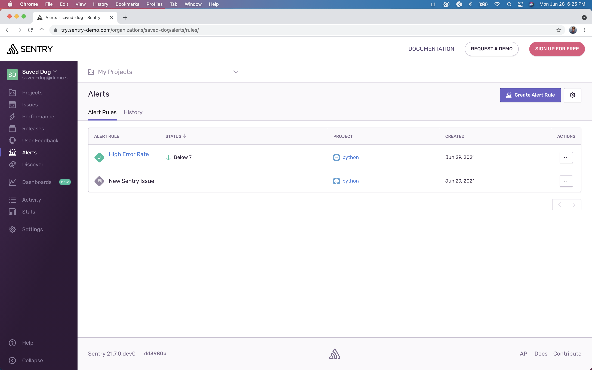

 

### Step 3.
Select the react project:

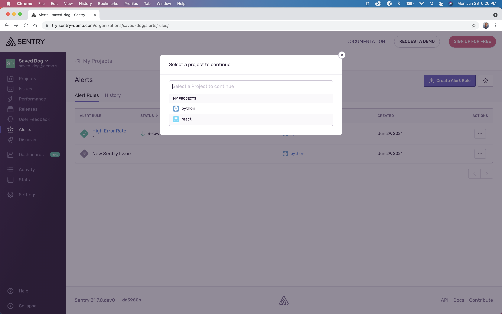

 

### Step 4.
Under the Select Alert column, under Errors, select the radio button labeled "Number of Errors." In the bottom right corner, select the purple button labeled "Set Conditions":

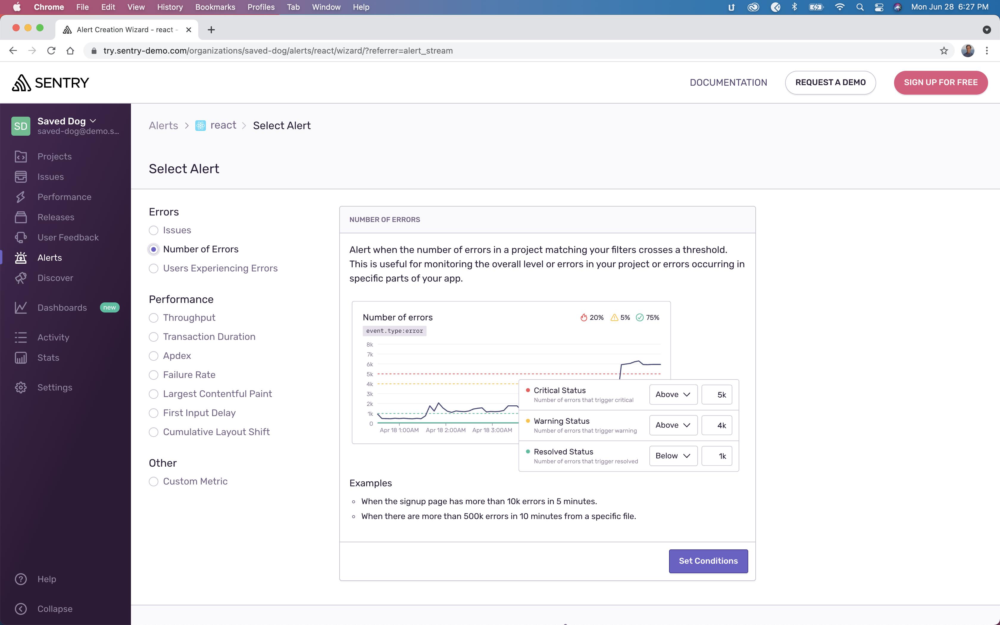

 

### Step 5.
Scroll down until you see the (1) Filter events dropdown menus. Select `event.type:error` and type `browser.name:Chrome`:

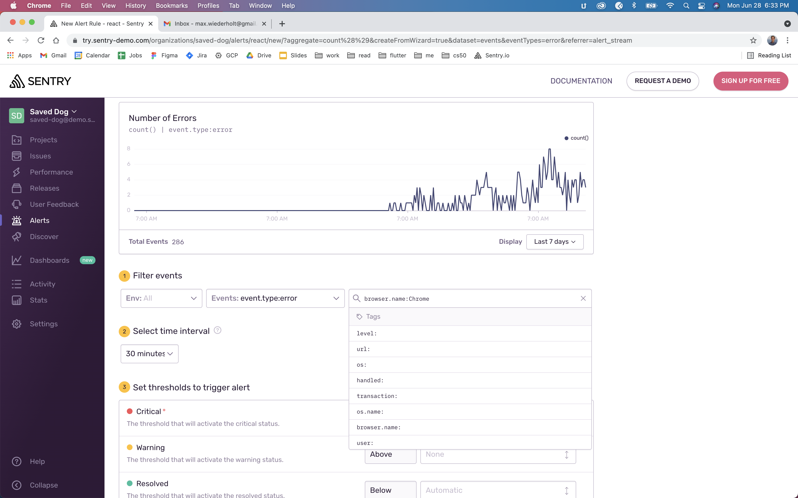

 

### Step 6.
Set your desired thresholds to trigger an alert, and define which actions Sentry should take when these conditions are met:

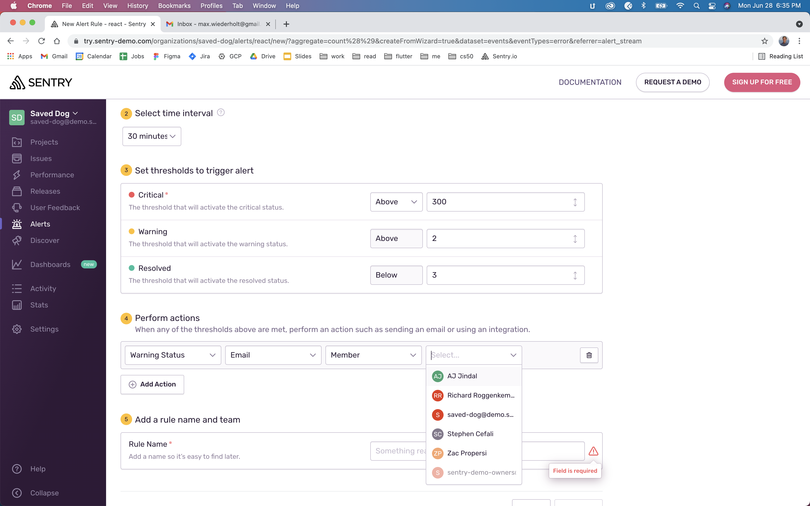

 

### Step 7.
Name the rule, then click the purple button labeled Save Rule.

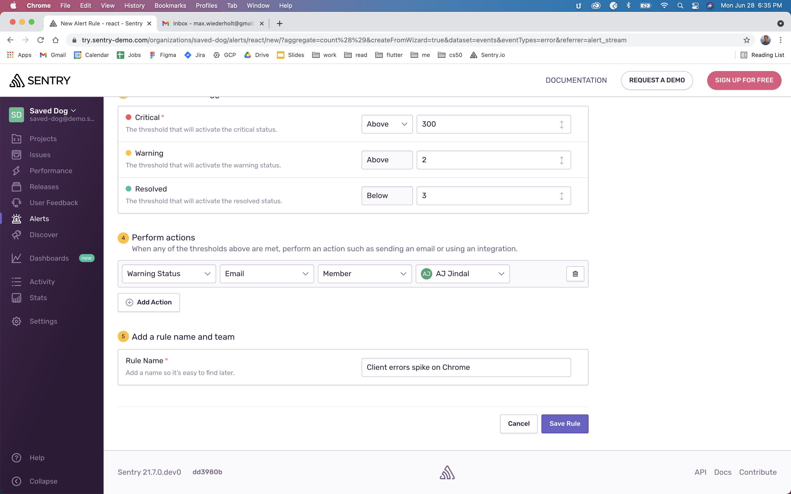

 

### Voila!
You've successfully set up a Sentry alert. Your team will now receive an email when your front-end project sees more than 3 error events triggered on a Chrome browser in a 30 minute window.

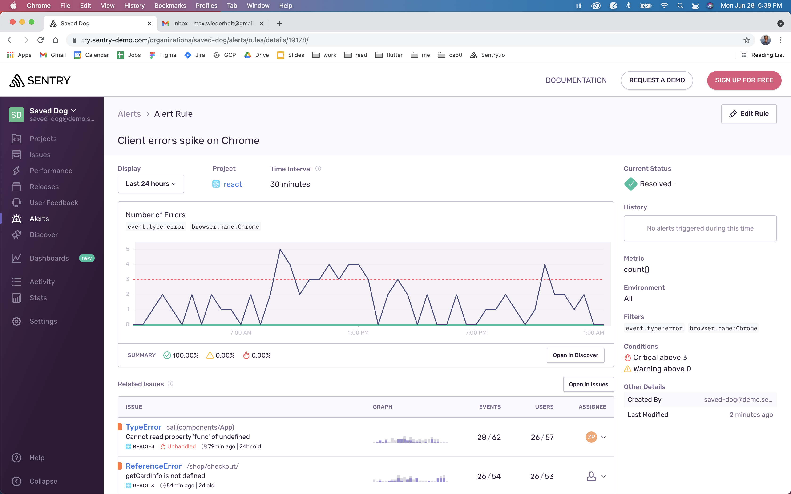

 

I hope that helps! Please let me know if there is anything else I can do to help.

Best,

Max Wiederholt

Solutions Engineer @ Sentry.io  
max.wiederholt@sentry.io

 
 
 

***
 
 
 

## 2.2 Discover

 

Hi Ido,

Thank you for your email! I've included some screenshots below to help walk you through this process using a Sentry Sandbox demo. After playing around in the Sandbox, you should be ready to set up your own custom Sentry Discover queries.

 

### Step 1.
Visit www.sentry.io/welcome/, and click on the Sandbox button in the top navigation bar:

 

### Step 2.
Select the white "Build a new query" button from the Discover Trends box.

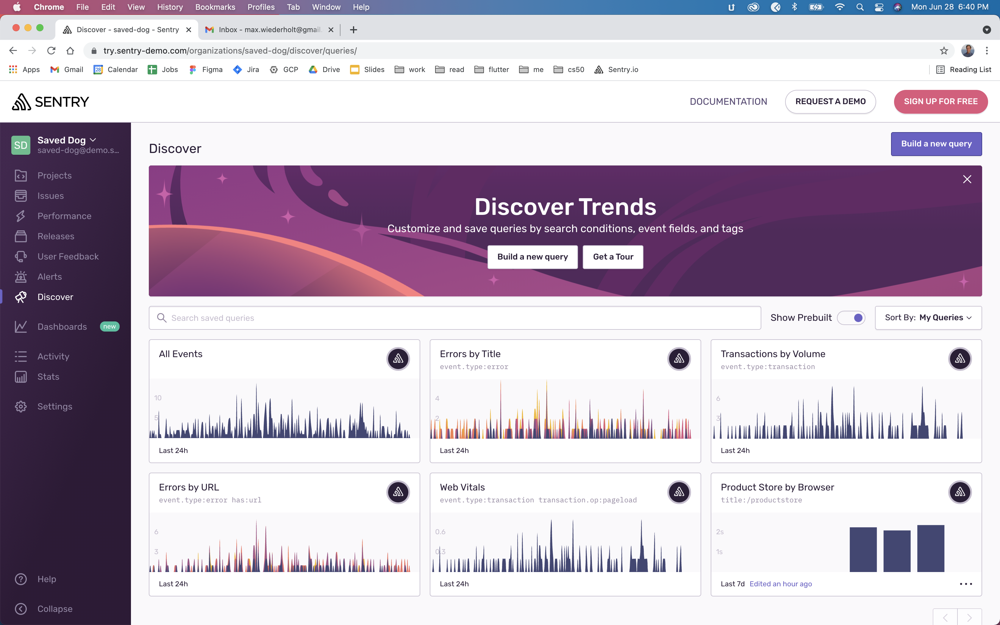

 

### Step 3.
Select your project from the "My Projects" dropdown menu in the top middle navigation bar.

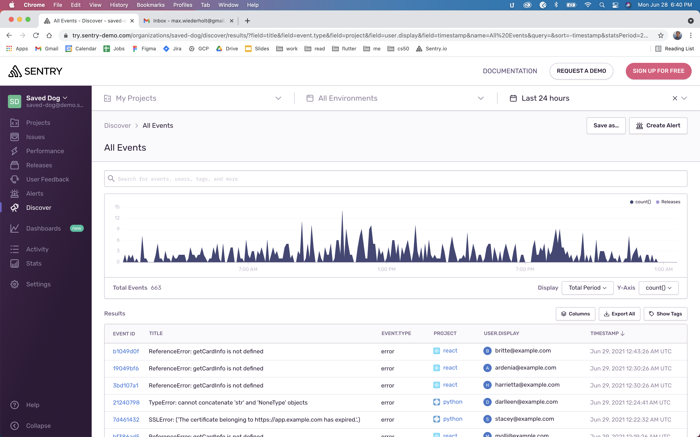

 

### Step 4.
Select your project from the "My Projects" dropdown menu in the top middle navigation bar.

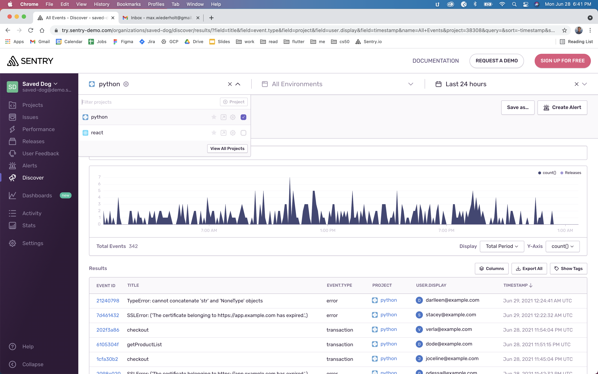

 

### Step 5.
In the search bar under the "All Events" header, type "country" then select geo.country_code: to filter your events by country. Append "geo.country_code:" with your choice of country code. (Eg, "AU", "GB", "US")

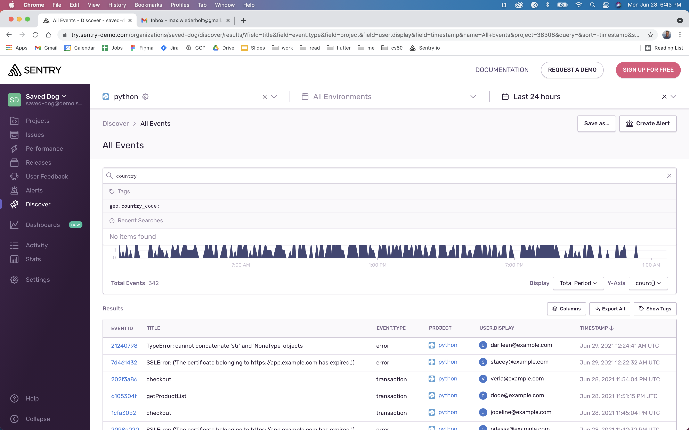

 

### Step 6.
In the search bar under the "All Events" header, type "country" then select geo.country_code: to filter your events by country. Append "geo.country_code:" with your choice of country code. (Eg, "AU", "GB", "US")

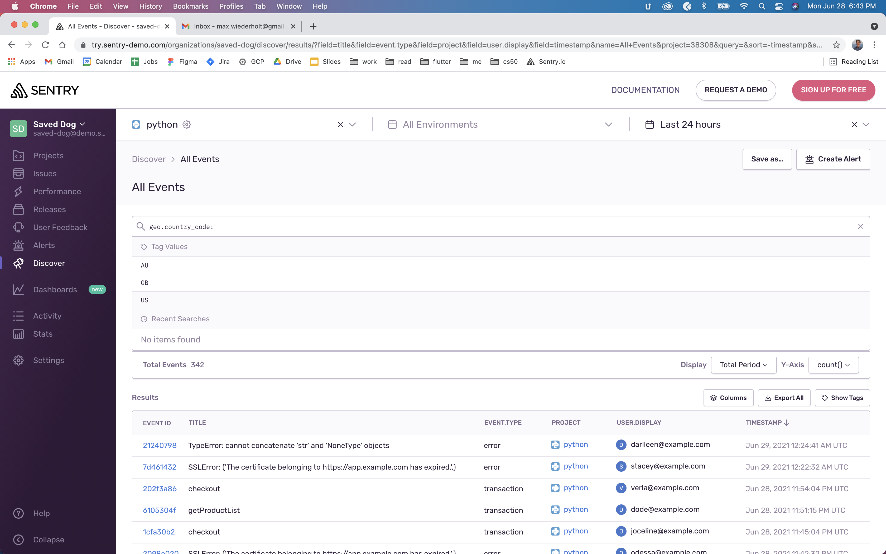

 

### Step 7.
Add event.type:error to the search bar, then type return. You should see a chart of events, with the count of total events beneath it.

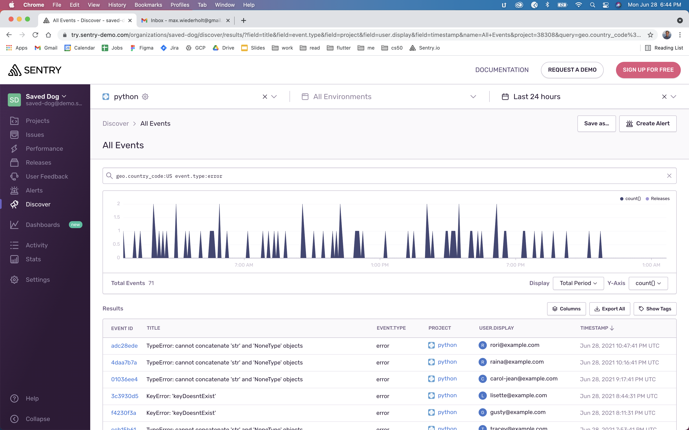

 

I hope that helps! Please let me know if there is anything else I can do to help.

Best,

Max Wiederholt

Solutions Engineer @ Sentry.io  
max.wiederholt@sentry.io

 
 
 

***

 

## 3.1 React Project With Sentry Integration > Sentry Error Monitoring with React

 

Hi Ido,

Thank you for your email! I just built a sample React project with Sentry integrated, which you can find on Github here: https://github.com/maaaaaaaax/sentry-solutions-engineer/tree/main/3.1/my-app

You'll find the Sentry integration in src/index.js, and you can read Sentry's React documentation here.

Let me know if you have any trouble downloading and running the sample project, or if you have any other questions!

Best,

Max Wiederholt

Solutions Engineer @ Sentry.io  
max.wiederholt@sentry.io

 
 
 

***

 

## 3.2 React Project With Sentry Integration > Sentry Performance Monitoring with React

 

Hi Ido,

Thank you for your email! I just enabled Sentry performance monitoring on the sample React project I shared with you previously. You can try out the latest version on Github here: https://github.com/maaaaaaaax/sentry-solutions-engineer/tree/main/3.2/my-app

If you get stuck with performance monitoring, I recommend Sentry's documentation here: https://docs.sentry.io/platforms/javascript/guides/react/performance/

Please let me know if you have any trouble downloading and running the sample project, or if you have any other questions. Good luck!

Best,

Max Wiederholt

Solutions Engineer @ Sentry.io  
max.wiederholt@sentry.io

 
 
 